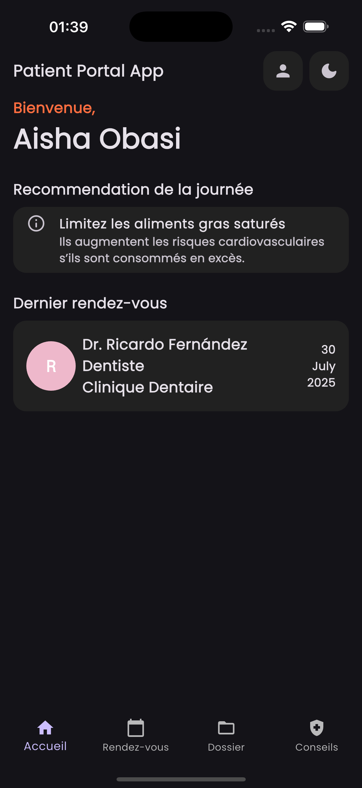
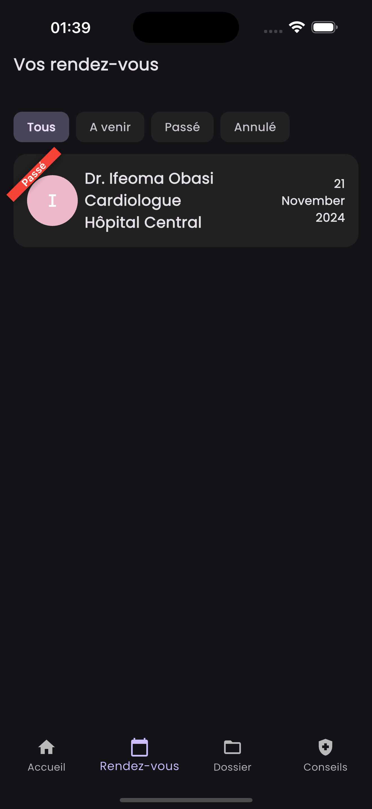
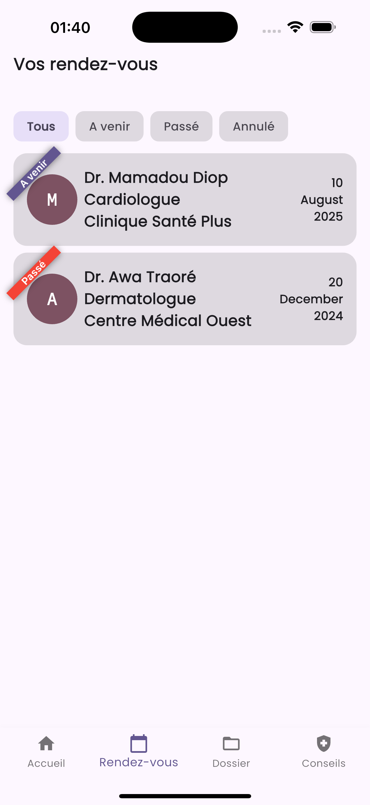
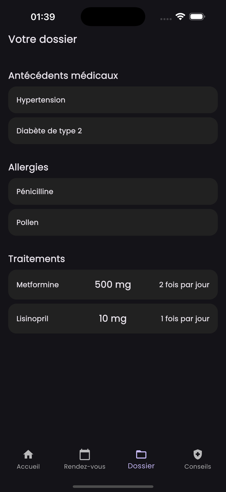
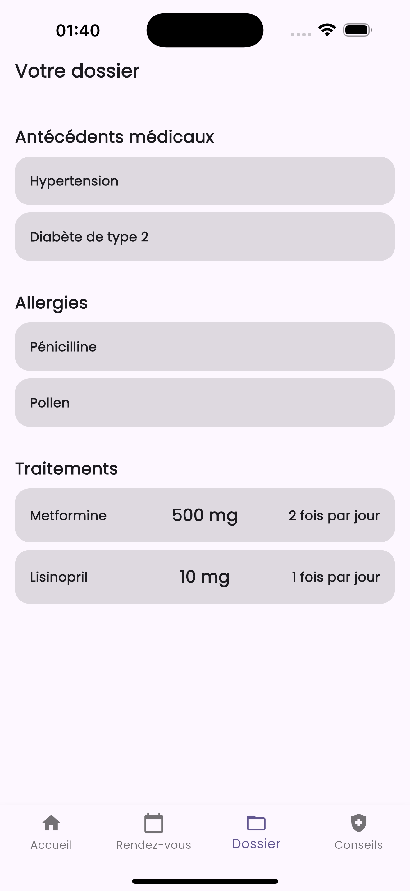
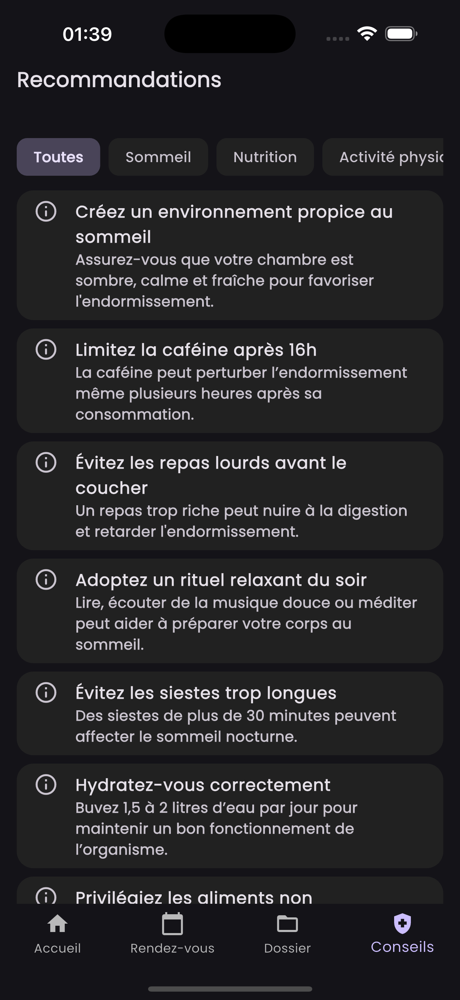
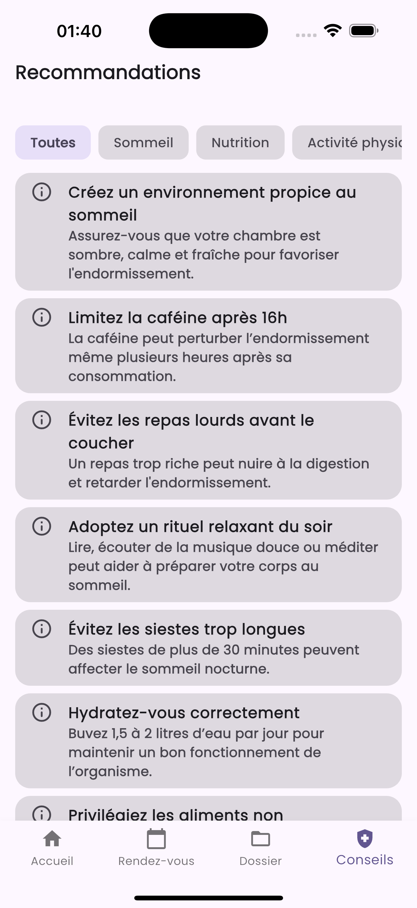

# Patient Portal App - Application Flutter

> Une application de suivi médical personnel construite avec Flutter, Riverpod, GoRouter et un design adaptatif clair/sombre.

## I - Objectif

L'application **Patient Portal App** simule un patient en lui permettant de :

- Gérer ses **rendez-vous médicaux**
- Suivre son **dossier médical**
- Consulter des **recommandations santé personnalisées**
- Naviguer facilement entre les sections avec une **navigation par onglets**

Elle est conçue pour être **rapide**, **accessible** et **intelligente**, avec un système de **stockage local de données simulées (Mock)**.

**Bonus** : 
- On peut choisir un patient parmis tant d´autres afin de voir ce que cac donnerait pour chaque patient.
- Bascule entre mode sombre et mode clair

---

## II - Dépendances principales

Voici les packages Flutter utilisés :

| Package                        | Usage                              |
|-------------------------------|-------------------------------------|
| `flutter_riverpod`            | Gestion d'état moderne              |
| `go_router`                   | Navigation déclarative              |
| `google_fonts`                | Police d´ecriture                   |
| `equatable`                   | Comparaison des objets              |
| `shared_preferences`          | Stockage local (theme, ID patient)  |
| `intl`                        | Formatage des dates                 |

---

## III - Gestion d’état

- **Riverpod** a été choisi pour :
  - Sa simplicité dans la déclaration de providers.
  - La séparation propre entre `State`, `Controller`, et `Service`.
  
**Exemples de State/Controller** :
- `appointmentControllerProvider`
- `homeControllerProvider`
- `themeModeControllerProvider`

---

## IV - Captures d'écran

Voici quelques images de l'application :

### Accueil
<p>
  
  
</p>


### Rendez-vous
<p>
  
  
</p>

### Dossier médical
<p>
  
  
</p>

### Recommandations
<p>
  
  
</p>

---

## 🚀 Instructions d'exécution

1. **Clonez le projet** :
   ```bash
   git clone https://github.com/monpseudo/monsuivisante.git
   cd monsuivisante
2. **Installez les dépendances** :
    ```bash
    flutter pub get
3. **Lancez l'application** :
    ```bash
    flutter run